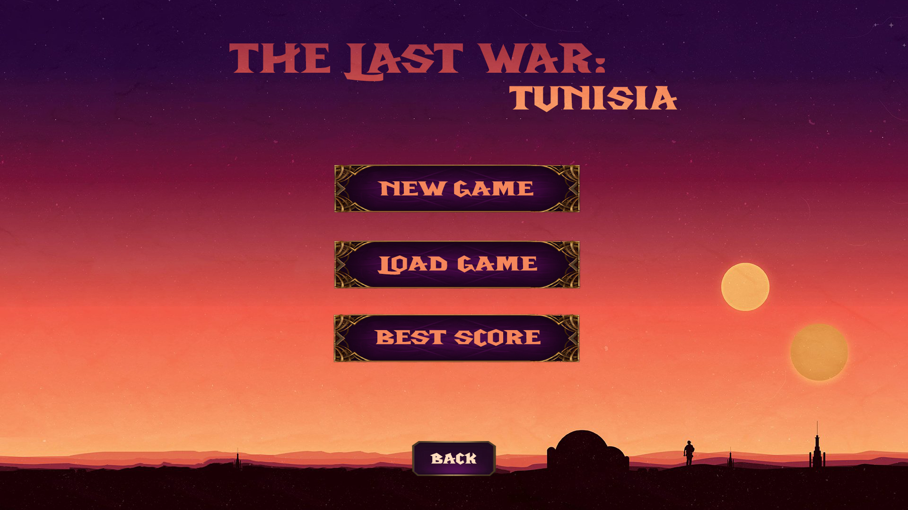
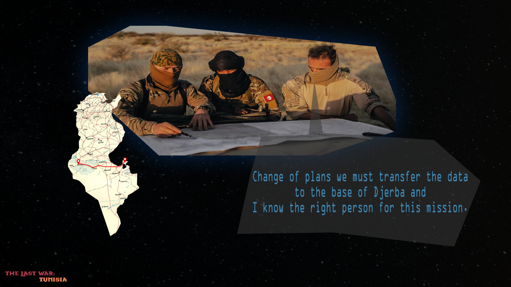
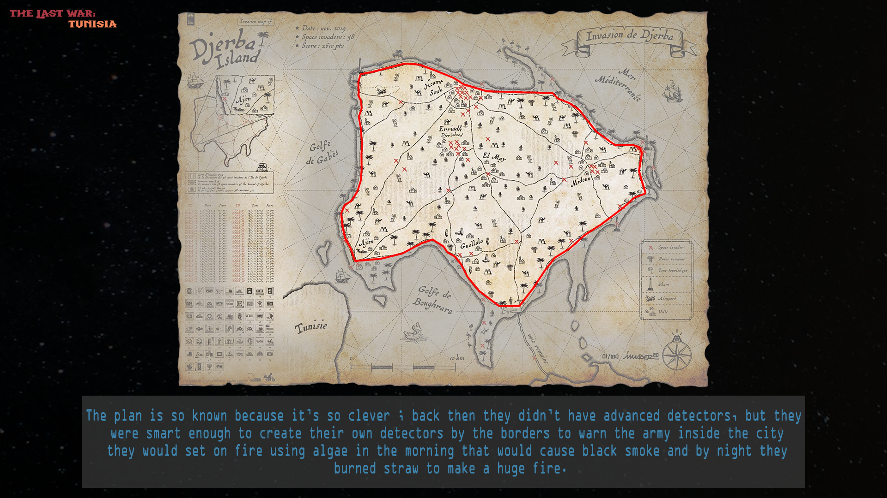
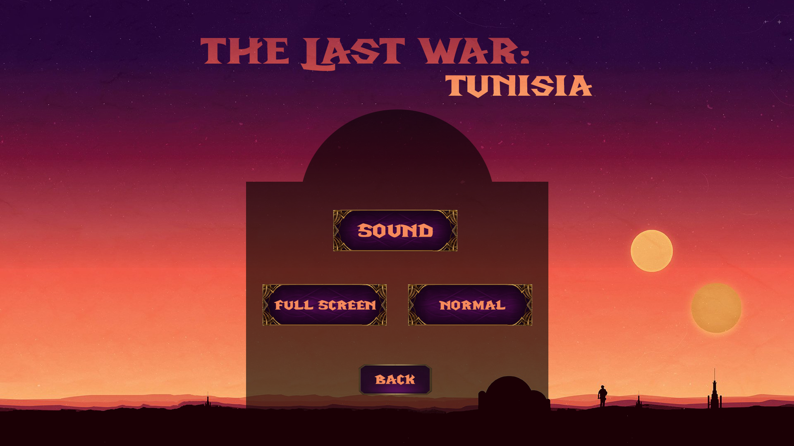
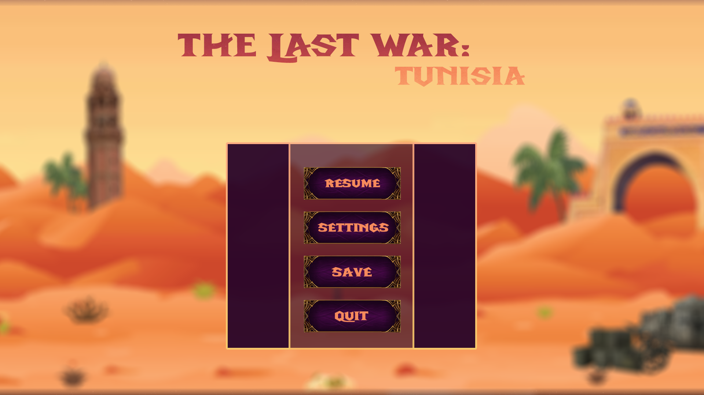
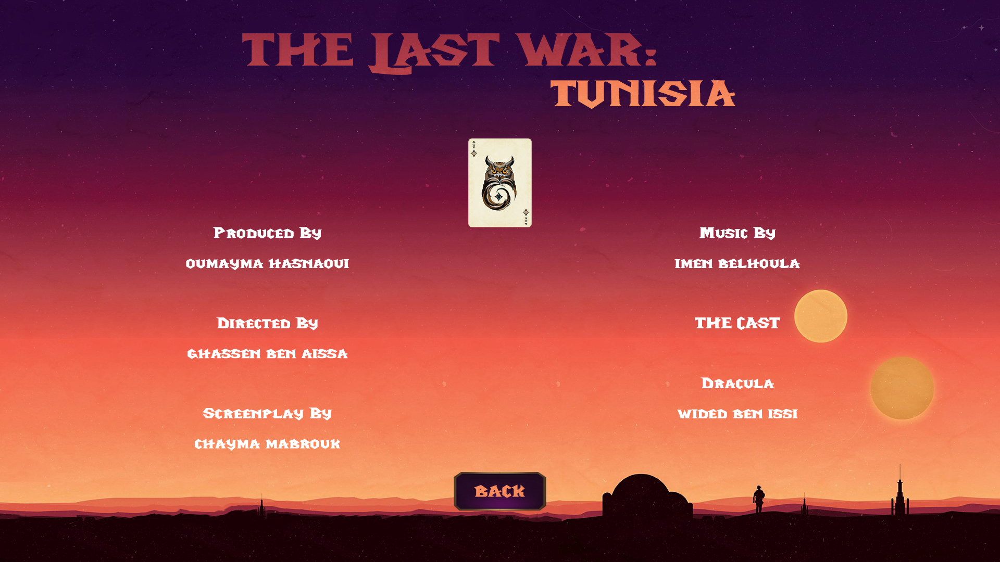

# The Last War: Tunisia

> A 2D side-scrolling adventure game set in Tunisia, inspired by the Star Wars filming locations across the Tunisian landscape — from the deserts of Tozeur to the island of Djerba.

<p align="center">
  
</p>

## About

**The Last War: Tunisia** is a 2D action-adventure platformer built in **C** with **SDL 1.2**. The player embarks on a journey across three levels, each showcasing iconic Tunisian landmarks and historical monuments encountered along the route from **Tozeur** to **Djerba**.

The game features pixel-perfect collision detection, enemy AI with patrol and chase behaviors, a puzzle system based on Tunisian culture and history, a real-time minimap, a scoring/leaderboard system, and a local two-player split-screen mode.

### Academic Context

This project was developed as part of the academic curriculum at **ESPRIT** (École Supérieure Privée d'Ingénierie et de Technologies). It was presented at the school's **Bal de Projet** event, where it earned **3rd place**.

## Story

The deserts of southern Tunisia hide an ancient secret — a weapon of immense power, buried beneath the sands and guarded across generations by local custodians. For centuries, it remained hidden from the outside world.

But extraterrestrial forces have discovered its location. When the ancient security system triggers, the guardian must act: transport the weapon from its resting place in **Tozeur** across the Tunisian landscape to a new hiding place on the island of **Djerba** — another site steeped in mystery.

The journey takes you through real Tunisian geography and monuments, paying homage to the same landscapes that served as filming locations for the Star Wars saga. Your mission: reach Djerba safely, solving ancient riddles and fighting off enemies along the way.

## Screenshots

### Storyline — Cinematic Cutscenes

<p align="center">
  
</p>
<p align="center"><i>The mission is revealed: transfer the data to the base of Djerba</i></p>

<p align="center">
  
</p>
<p align="center"><i>The ancient map of Djerba Island and its defense systems</i></p>

### Menu System

<p align="center">
  
  
</p>
<p align="center">
  
  
</p>

## Features

| Feature | Description |
|---------|-------------|
| **3 Levels** | Each level represents a stage of the Tozeur → Djerba journey, with unique maps featuring Tunisian monuments |
| **Pixel-Perfect Collision** | Color-coded mask system for precise terrain interaction (walls, hazards, triggers) |
| **Enemy AI** | Enemies with patrol zones, player detection (200px range), and chase/attack behaviors |
| **Puzzle System** | Timed riddles (60s) about Tunisian history and culture to unlock doors between levels |
| **Minimap & Timer** | Real-time minimap tracking player progress + in-game timer |
| **Save/Load** | Binary save system preserving player position, enemy state, health, time, and score |
| **Leaderboard** | Persistent best score tracking with player name input |
| **Split-Screen Multiplayer** | Local 2-player mode with independent cameras and collision |
| **Sound System** | Background music per level + sound effects, with adjustable volume (0/25/50/75/100%) |
| **Fullscreen Toggle** | Switch between windowed and fullscreen modes |

## Getting Started

### Prerequisites

- **GCC** compiler
- **SDL 1.2** development libraries:
  - `libSDL`
  - `libSDL_image`
  - `libSDL_ttf`
  - `libSDL_mixer`

#### Install on Debian/Ubuntu
```bash
sudo apt-get install libsdl1.2-dev libsdl-image1.2-dev libsdl-ttf2.0-dev libsdl-mixer1.2-dev
```

#### Install on macOS (Homebrew)
```bash
brew install sdl sdl_image sdl_ttf sdl_mixer
```

### Build & Run

```bash
cd game
make
./prog
```

To clean build artifacts:
```bash
make clean
```

## Controls

| Key | Action |
|-----|--------|
| `←` `→` | Move left / right |
| `↑` `↓` | Jump / Crouch (+ navigate enigma answers) |
| `Enter` | Confirm selection |
| `Escape` | Return to menu / Exit |
| Mouse | Menu navigation and enigma answer selection |

## Project Structure

```
├── game/
│   ├── Makefile
│   ├── src/               # C source code (29 files) and headers
│   ├── assets/
│   │   ├── audio/         # Music tracks (.mp3) and sound effects (.wav)
│   │   ├── fonts/         # TTF fonts for UI rendering
│   │   ├── images/        # Menu screens, UI elements, game over/win screens
│   │   ├── maps/          # Level backgrounds, collision masks, minimaps
│   │   └── sprites/       # Character animations, enemies, doors, effects
│   └── data/              # Save files, puzzle questions/answers, scores
├── docs/                  # Detailed documentation
│   ├── GAMEPLAY.md        # Game mechanics and systems
│   └── ARCHITECTURE.md    # Technical architecture and code structure
└── README.md
```

## Documentation

- **[Gameplay Guide](docs/GAMEPLAY.md)** — Detailed game mechanics, level design, and systems
- **[Technical Architecture](docs/ARCHITECTURE.md)** — Code structure, algorithms, and implementation details

## Tech Stack

| Technology | Usage |
|------------|-------|
| **C** | Core game logic |
| **SDL 1.2** | Window management, rendering, input handling |
| **SDL_image** | PNG/JPG image loading |
| **SDL_ttf** | TrueType font rendering |
| **SDL_mixer** | Audio playback (MP3, WAV) |
| **GCC** | Compilation |
| **Make** | Build system |

## Team

| Role | Name |
|------|------|
| **Director** | Ghassen Ben Aissa |
| **Producer** | Oumayma Hashaoui |
| **Screenplay** | Chayna Mabrouk |
| **Music** | Imen Belhoula |
| **Cast — Dracula** | Wided Ben Issi |

## License

This project was created for educational purposes at ESPRIT.

---

<p align="center">
  <i>A tribute to Tunisia's heritage through interactive media</i>
</p>
